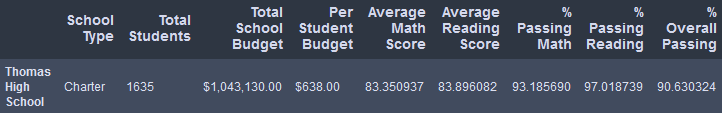

# Pandas School District
Analyze the districts data with Pandas

---

## Overview of the School District Analysis
After compiling different datasets of a school district into DataFrames for analysis, I found out that some of the data in the students_complete.csv file showed evidence of academic dishonesty. While keeping the rest of the data intact, I replaced the cheated data with NaNs and reran my analysis. I used Python, Jupyter Notebook, and Pandas to repeat the school district analysis in [PyCitySchools_Challenge](PyCitySchools_Challenge.ipynb) and kept the old report in [PyCitySchools(Old)](PyCitySchools(Old).ipynb).  

## Results
- **How is the district summary affected?**  
   At a glance, the district summary looks practically the same, but there are a few takeaway points. The overall percentage of students passing both math and reading has decreased by 0.1%, which isn't much of a difference, but it shows that the data removed had values that were above average.  
   
- **How is the school summary affected?**  
   In the school summary, the only school with altered results is Thomas High School. This adds up because the only data thrown out were all ninth-graders from Thomas High School.  

   

- **How does replacing the ninth graders' math and reading scores affect Thomas High School's performance relative to the other schools?**  
   Thomas High School still ranks second in the district after the ninth graders were removed. Surprisingly, removing the whole grade suspected of academic dishonesty only slightly dropped the percentage of the school passing by 0.3%.  
   
- **How does replacing the ninth-grade scores affect**  
  - **Math and reading scores by grade?**  
     The new DataFrame shows 'NaN' for Thomas High Schools's 9th grade. Looking at the old DataFrame we can see that the 9th grade had the highest math score and the second-highest reading score, both within 0.1% of another grade.  

  - **Scores by school spending?**  
     The only difference in the DataFrames is the values attached to the index $630-644. All of the changed data is only a few hundredths of a percent lower than before.  
     
  - **Scores by school size?**  
     It's the same case for scores by school size as it was for scores by school spending, with the averages of small schools only lowered by a few hundredths.  

  - **Scores by school type?**  
     These scores follow a similar pattern with the past few DataFrames, being that any values changed are not significant. Only charter schools had different data, which can be attributed to Thomas High School being a charter school.  

## Summary
Removing reading and math scores for the ninth grade at Thomas High School slightly altered a lot of the data. The biggest changes were the slight decrease in the overall school district scores, Thomas High School's overall percentage of students passing decreasing by three tenths, the complete removal of the 9th grade in math and reading scores by each grade, and the change in charter schools averages. Even though removing those scores ended up affecting a lot of the analysis, all of the changes were very minor.  